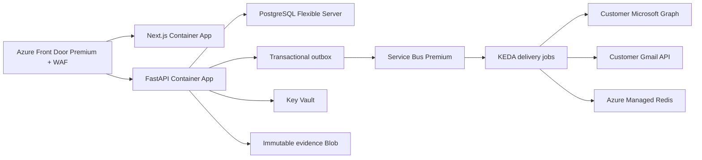

# BreachSim

**Multi-tenant enterprise security-awareness simulation and human-risk platform.**

The first live release supports authorized **Email and QR** campaigns. It connects to each
customer's Microsoft 365 or Google Workspace sender, generates a unique expiring link/QR for
every selected employee, records provider acceptance/bounces and real link opens, and produces
pseudonymous evidence by default. Landing pages never collect passwords, MFA codes or payment
data.

> Final Year Project — Hamza Jawad, Raiya Batool, Muzna Imran
> Department of Cyber Security, National Cyber Security Academy, Air University Islamabad

---

## Channels

| Channel | Enterprise behavior | Delivery provider |
|---|---|---|
| **Email** | Branded HTML/text email with a unique approved-platform link | Microsoft Graph or Gmail API |
| **QR** | Standards-compliant 320px+ PNG displayed inline through a non-tracking image endpoint | Microsoft Graph or Gmail API |

SMTP remains a local/demo adapter and is refused by the production run path. SMS, voice
cloning and video impersonation remain disabled or sandbox-only for the initial launch.

---

## Architecture



**Stack**

- **Backend** — FastAPI, SQLAlchemy 2, Alembic, PostgreSQL, Service Bus and Managed Redis
- **Frontend** — Next.js App Router, TypeScript, Tailwind CSS, Recharts
- **AI** — Together AI (`openai/gpt-oss-20b`) behind a pluggable provider interface, with a
  deterministic rule-based fallback so the platform remains functional without an API key
- **Security** — revocable server sessions in secure cookies, CSRF protection, MFA, RBAC,
  field-level encryption, hash-chained audit logs, tenant/hostname binding and pseudonymous
  reporting

---

## Quick start

### Docker Compose

```bash
docker compose up --build
```

| Service | URL |
|---|---|
| Frontend | http://localhost:3000 |
| API | http://localhost:8000 |
| API docs | http://localhost:8000/docs |

This command starts the development/demo stack. For an internet-facing deployment, use the
fail-closed production stack and runbook in
[docs/production-deployment.md](docs/production-deployment.md); it adds HTTPS, private data
networks, health checks, migrations, revocable sessions, rate limiting, persistent volumes,
and a non-demo administrator bootstrap.

### Local development

Backend:

```bash
cd backend
python -m pip install -r requirements-dev.lock
python -m pip install --no-deps -e .
python -m pytest -q tests
uvicorn app.main:app --reload --host 127.0.0.1 --port 8000
```

Frontend:

```bash
cd frontend
npm ci
npm run dev
```

Create `frontend/.env.local`:

```
NEXT_PUBLIC_API_BASE_URL=http://127.0.0.1:8000/api/v1
NEXT_PUBLIC_DEMO_MODE=true
```

`NEXT_PUBLIC_DEMO_MODE=true` shows demo credentials on the login screen. Leave it unset or
`false` for anything resembling production.

### Together AI scenario generation

For Docker Compose, place these values in the repository-root `.env`. For a backend started
directly from `backend/`, place them in `backend/.env` or export them in the process environment:

```env
AI_PROVIDER=together
TOGETHER_API_KEY=
TOGETHER_MODEL=openai/gpt-oss-20b
```

Create the key in the Together AI console and paste it only into the untracked `.env`; never
put it in a frontend `NEXT_PUBLIC_*` variable. In **Together AI → Settings → Privacy &
Security**, choose **No** for storing prompts and training use to enable Zero Data Retention.
The application assumes that account-level control is enabled; there is no request header
that can enable ZDR on an account.

Together receives only placeholder-based scenario context such as `{{first_name}}`,
`{{company_name}}`, `{{department}}`, and `{{role_title}}`. Employee profiles, failure history,
training history, and raw identifiers remain in the backend. Generated placeholders are
replaced locally only after the response passes schema and safety validation.

Use `AI_PROVIDER=rule_based` to run without Together. Timeout, rate-limit, transport, or invalid
response failures automatically fall back to the same deterministic generator.

If Together responds with `model_not_available`, the requested `openai/gpt-oss-20b` model
requires an active dedicated endpoint for this account. An API key and prepaid credit alone
do not activate it. BreachSim labels the resulting draft as a built-in fallback and shows
the reason in Scenario Studio; it does not claim the draft came from Together. Review the
cost in [Together Endpoints](https://api.together.ai/endpoints) before starting an endpoint.
Keep `TOGETHER_MODEL=openai/gpt-oss-20b` unless you intentionally choose a different model.

### Seeded development accounts

These accounts exist only in development when `SEED_DEMO_CONTENT=true`. Production startup
never creates them and rejects demo seeding.

| Role | Email | Password |
|---|---|---|
| Admin | `admin@breachsim-lab.com` | `Admin123!` |
| Second admin (reviewer) | `reviewer@breachsim-lab.com` | `Reviewer123!` |
| Campaign manager | `manager@breachsim-lab.com` | `Manager123!` |
| Auditor | `auditor@breachsim-lab.com` | `Auditor123!` |

Two admin accounts exist because approval is a **two-person rule** — the admin who creates a
scenario or registers a persona cannot be the one who approves it.

---

## Demo in one command

With the API running:

```bash
cd backend
python scripts/demo_seed.py --run-interactive
```

This provisions the governance objects and runs one campaign per channel end to end through
the public API — no guardrail is bypassed — then prints the tokenized employee entry point
for each channel so you can walk the flow on screen.

---

## Core flow

1. Sign in as admin.
2. **Governance → Controls** — enable the channels and themes this organization may run.
   New capabilities ship disabled so an upgrade never silently widens scope.
3. **Governance → Personas** — register an impersonation persona; a *second* admin approves it.
   Required for voice and deepfake only.
4. **Directory** — import or review employees and their approved context.
5. **Scenario Studio** — generate content for a channel; review the branching script; approve.
6. **Campaigns** — select a healthy customer sender and verified landing domain, approve, then
   launch a durable run with an idempotency key.
7. Open the employee entry point and interact.
8. **Command Center / Risk Intelligence** — see behaviour, risk movement and the adaptive
   retest recommendation.
9. **Reports** — download the campaign evidence pack (HTML for print/PDF, CSV for analysis).

---

## Guardrails

Enforced **server-side**, before content is generated — a violating scenario is refused, not
warned about.

- **Policy engine** — allowed channels, themes, difficulty levels, prohibited words and
  topics, approved training domains, working hours, per-employee frequency cap.
- **Two-person rule** — separate administrators for creation and approval, on both campaigns
  and impersonation personas.
- **Persona consent** — real-person impersonation requires a signed consent reference and a
  mandatory expiry. Lapsed consent auto-expires the persona and blocks every scenario using it.
- **Verified scope** — production delivery accepts only provisioned employees whose domains
  are verified for that tenant; opt-outs and hard-bounce suppressions are enforced at launch.
- **No credential capture** — landing pages record interaction events only. No password field
  ever stores a value.
- **Append-only audit log** — every approval, generation, revocation and launch is recorded.

---

## Verification

```bash
cd backend  && python -m pytest -q tests
cd frontend && npm run lint && npm run typecheck && npm run test:coverage && npm run build
cd infra/terraform && terraform fmt -check -recursive && terraform validate
```

Test coverage includes the impersonation consent guardrails (expired consent, revocation,
self-approval refusal), the branching simulation runtime (step replay rejection, answer-key
leakage, scoring), SMS GSM-7/UCS-2 segmentation, delivery semantics, and report generation.

---

## Third-party services

Local development can run with the deterministic generator and sandbox delivery. Live
enterprise campaigns require the customer's Microsoft 365 or Google Workspace authorization,
verified DNS and the Azure production services. Together AI is optional technically but is
the configured production narrative provider; its account-level ZDR setting must be confirmed.

ElevenLabs, D-ID and SMS provider settings are retained for sandbox research only and must
remain disabled in the initial production release.

---

## Project layout

| Path | Contents |
|---|---|
| [backend/app](backend/app) | FastAPI application |
| [backend/app/services/channel_content.py](backend/app/services/channel_content.py) | Branching script builders for voice and deepfake |
| [backend/app/services/personas.py](backend/app/services/personas.py) | Impersonation consent governance |
| [backend/app/services/simulation.py](backend/app/services/simulation.py) | Interactive simulation runtime |
| [backend/app/services/delivery.py](backend/app/services/delivery.py) | Five channel delivery adapters |
| [backend/scripts/demo_seed.py](backend/scripts/demo_seed.py) | One-command five-channel demo |
| [frontend/app](frontend/app) | Next.js routes |
| [frontend/components](frontend/components) | Consoles and simulators |
| [docs](docs) | Architecture, threat model, channel design |
| [sample_outputs](sample_outputs) | Example evidence exports |

## Documentation

- [Channel design and impersonation governance](docs/channels.md)
- [Architecture overview](docs/architecture/overview.md)
- [Threat model](docs/security/threat-model.md)
- [Privacy model](docs/security/privacy-model.md)
- [Demo script](docs/demo/presentation-script.md)
- [Foundation and phased plan](docs/foundation.md)
- [Production deployment and operations](docs/production-deployment.md)

---

## Ethics

BreachSim simulates deception in order to reduce harm from it. The platform is built so that
the simulation cannot become the attack:

- No real credentials are ever captured or stored.
- No real phone call is placed.
- Synthetic media is generated only for an explicitly consented and second-admin-approved
  persona. It is token-served, retention-bound, audited, and deleted on revocation.
- Impersonation is restricted to a consent-governed registry with expiry and revocation.
- Analytics are keyed to pseudonymous identifiers, and employees can opt out or request
  redaction through the self-service portal.

Simulations should only be run against an organization that has authorized them.
