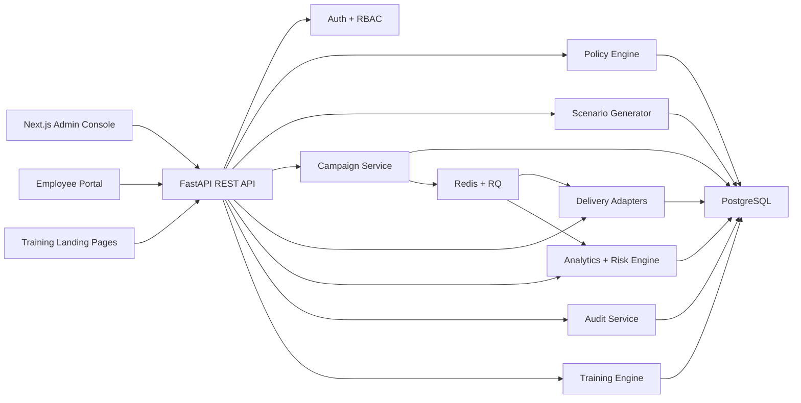

# BreachSim

BreachSim is a phishing simulation and security awareness MVP. It safely simulates phishing patterns across email, QR, and SMS, includes a clearly marked vishing script prototype, assigns micro-training, and tracks employee and department improvement over time.

Start with:

- Architecture, schema, routes, and phased plan: [docs/foundation.md](docs/foundation.md)
- Architecture overview: [overview.md](docs/architecture/overview.md)
- Threat model: [threat-model.md](docs/security/threat-model.md)
- Demo script: [presentation-script.md](docs/demo/presentation-script.md)

## Architecture



## Stack

- Backend: FastAPI, SQLAlchemy, Alembic, PostgreSQL, Redis, RQ
- Frontend: Next.js App Router, TypeScript, Tailwind CSS, Recharts
- Security: JWT auth, RBAC, field-level encryption, append-only audit logging, pseudonymous analytics IDs

## Quick Start

### Option 1: Docker Compose

```bash
docker compose up --build
```

Services:

- Frontend: `http://localhost:3000`
- Backend API: `http://localhost:8000`
- API docs: `http://localhost:8000/docs`

### Option 2: Local development

Backend:

```bash
cd backend
python3 -m pytest -s tests
uvicorn app.main:app --reload --host 0.0.0.0 --port 8000
```

Frontend:

```bash
cd frontend
npm install
node node_modules/next/dist/bin/next dev --hostname 0.0.0.0 --port 3000
```

Optional realistic scenario generation with Gemini:

```bash
cd backend
export GEMINI_API_KEY=your_google_ai_key
export GEMINI_MODEL=gemini-2.5-flash
uvicorn app.main:app --reload --host 0.0.0.0 --port 8000
```

If `GEMINI_API_KEY` is not set, BreachSim falls back to the built-in rule-based generator.

## Seeded Demo Users

- Admin: `admin@breachsim-lab.com` / `Admin123!`
- Second admin reviewer: `reviewer@breachsim-lab.com` / `Reviewer123!`
- Campaign manager: `manager@breachsim-lab.com` / `Manager123!`
- Auditor: `auditor@breachsim-lab.com` / `Auditor123!`

## Core MVP Flow

1. Log in as admin.
2. Inspect or import employees with approved context and profile data.
3. Review the organization policy and guardrails.
4. Generate a scenario from the Scenario Lab.
5. Approve the scenario and link it to a campaign.
6. Launch the campaign in sandbox mode.
7. Open a tokenized training page and record a safe event.
8. View updated analytics, risk scoring, micro-training assignments, and audit logs.

## Verification

- Backend tests: `python3 -m pytest -s tests`
  Result used during implementation: `8 passed`
- Frontend production build:
  Command used during implementation: `node node_modules/next/dist/bin/next build`
  Result used during implementation: succeeded

## Project Layout

- Backend app: [backend/app](backend/app)
- Frontend app: [frontend/app](frontend/app)
- Docs: [docs](docs)
- Sample exports: [sample_outputs](sample_outputs)
