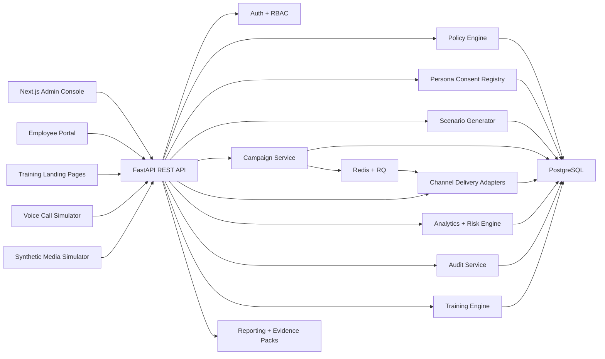

# BreachSim

**AI-driven multi-channel phishing simulation and human risk management platform.**

BreachSim runs governed social-engineering simulations across **five channels** — email, SMS,
QR, voice and synthetic-media (deepfake) impersonation — tracks what employees actually do,
scores individual and departmental human risk, assigns targeted remediation, and produces
evidence packs an assessor can read end to end.

> Final Year Project — Hamza Jawad, Raiya Batool, Muzna Imran
> Department of Cyber Security, National Cyber Security Academy, Air University Islamabad

---

## Channels

| Channel | What the target sees | Outbound? | Provider required |
|---|---|---|---|
| **Email phishing** | Inbox message with a tracked link | SMTP send | any SMTP account |
| **SMS / smishing** | Text message with a tracked link | REST send | paid SMS gateway |
| **QR phishing** | Printable poster with a tracked scan code | none | none |
| **Voice / vishing** | Branching phone call with escalating pressure | none | none |
| **Deepfake impersonation** | Voice note or video message from an approved persona | none | none |

Voice and deepfake simulations render **real cloned media** — a consented executive's voice
(ElevenLabs) and a talking-head video from their photo (D-ID) — when a provider is configured.
With no provider, they fall back to the in-browser Web Speech engine and still run end to end
at zero cost. Cloning is gated by the persona consent registry, and every generated clip is
retention-bound, token-served, and destroyed on revocation. See
[docs/channels.md](docs/channels.md) for the full design and safety model.

---

## Architecture



**Stack**

- **Backend** — FastAPI, SQLAlchemy 2, Alembic, PostgreSQL, Redis, RQ
- **Frontend** — Next.js App Router, TypeScript, Tailwind CSS, Recharts
- **AI** — pluggable provider (Ollama / OpenAI / Gemini) with a deterministic rule-based
  fallback, so the platform is fully functional with **no LLM configured**
- **Security** — JWT auth, RBAC, field-level encryption, append-only audit log,
  pseudonymous analytics identifiers

---

## Quick start

### Docker Compose

```bash
docker compose up --build
```

| Service | URL |
|---|---|
| Frontend | http://localhost:3000 |
| API | http://localhost:8000 |
| API docs | http://localhost:8000/docs |

### Local development

Backend:

```bash
cd backend
python -m pytest -q tests
uvicorn app.main:app --reload --host 127.0.0.1 --port 8000
```

Frontend:

```bash
cd frontend
npm ci
npm run dev
```

Create `frontend/.env.local`:

```
NEXT_PUBLIC_API_BASE_URL=http://127.0.0.1:8000/api/v1
NEXT_PUBLIC_DEMO_MODE=true
```

`NEXT_PUBLIC_DEMO_MODE=true` shows demo credentials on the login screen. Leave it unset or
`false` for anything resembling production.

### Seeded accounts

| Role | Email | Password |
|---|---|---|
| Admin | `admin@breachsim-lab.com` | `Admin123!` |
| Second admin (reviewer) | `reviewer@breachsim-lab.com` | `Reviewer123!` |
| Campaign manager | `manager@breachsim-lab.com` | `Manager123!` |
| Auditor | `auditor@breachsim-lab.com` | `Auditor123!` |

Two admin accounts exist because approval is a **two-person rule** — the admin who creates a
scenario or registers a persona cannot be the one who approves it.

---

## Demo in one command

With the API running:

```bash
cd backend
python scripts/demo_seed.py --run-interactive
```

This provisions the governance objects and runs one campaign per channel end to end through
the public API — no guardrail is bypassed — then prints the tokenized employee entry point
for each channel so you can walk the flow on screen.

---

## Core flow

1. Sign in as admin.
2. **Governance → Controls** — enable the channels and themes this organization may run.
   New capabilities ship disabled so an upgrade never silently widens scope.
3. **Governance → Personas** — register an impersonation persona; a *second* admin approves it.
   Required for voice and deepfake only.
4. **Directory** — import or review employees and their approved context.
5. **Scenario Studio** — generate content for a channel; review the branching script; approve.
6. **Campaigns** — build a campaign, take it through dual approval, deliver.
7. Open the employee entry point and interact.
8. **Command Center / Risk Intelligence** — see behaviour, risk movement and the adaptive
   retest recommendation.
9. **Reports** — download the campaign evidence pack (HTML for print/PDF, CSV for analysis).

---

## Guardrails

Enforced **server-side**, before content is generated — a violating scenario is refused, not
warned about.

- **Policy engine** — allowed channels, themes, difficulty levels, prohibited words and
  topics, approved training domains, working hours, per-employee frequency cap.
- **Two-person rule** — separate administrators for creation and approval, on both campaigns
  and impersonation personas.
- **Persona consent** — real-person impersonation requires a signed consent reference and a
  mandatory expiry. Lapsed consent auto-expires the persona and blocks every scenario using it.
- **Recipient allowlists** — live email and SMS can only reach addresses/numbers explicitly
  listed. A misconfigured campaign cannot reach an unintended inbox.
- **No credential capture** — landing pages record interaction events only. No password field
  ever stores a value.
- **Append-only audit log** — every approval, generation, revocation and launch is recorded.

---

## Verification

```bash
cd backend  && python -m pytest -q tests      # 32 passed
cd frontend && npx next build                 # 17 routes, build succeeded
```

Test coverage includes the impersonation consent guardrails (expired consent, revocation,
self-approval refusal), the branching simulation runtime (step replay rejection, answer-key
leakage, scoring), SMS GSM-7/UCS-2 segmentation, delivery semantics, and report generation.

---

## Third-party services

**Nothing in this list is required to run, demo or submit the project.** Every channel works
without any paid account.

| Capability | Needed for | Cost |
|---|---|---|
| SMTP account | Real email delivery to your own test inbox | Free (Gmail app password) |
| SMS gateway (Twilio-compatible) | Real SMS delivery | **Paid** — sandbox otherwise |
| **ElevenLabs API key** | **Real cloned voice** for voice/deepfake | **Paid** — browser speech engine otherwise |
| **D-ID API key** | **Real talking-head deepfake video** | **Paid** — abstract avatar otherwise |
| OpenAI / Gemini API key | Higher-realism generated copy | **Paid** — rule-based generator otherwise |
| Ollama (local) | Local AI generation | Free, self-hosted |

Without a provider, a channel runs as a clearly-labelled sandbox/fallback: the full campaign,
tracking, scoring and reporting pipeline still executes, the simulation still plays (in a
generic voice), and the console states plainly what is degraded.

### Enabling real voice/video cloning

```
VOICE_CLONE_PROVIDER=elevenlabs
ELEVENLABS_API_KEY=sk_...
VIDEO_CLONE_PROVIDER=did
DID_API_KEY=...
```

Then, in **Governance → Personas**: register a persona as a **real person** with a consent
reference, upload a short voice sample (and a face photo for video), and have a second admin
approve it. Voice and deepfake scenarios generated against that persona now speak in the
cloned voice and play a talking-head video. Revoking the persona deletes every generated clip
and retires the enrolled voice at the provider.

---

## Project layout

| Path | Contents |
|---|---|
| [backend/app](backend/app) | FastAPI application |
| [backend/app/services/channel_content.py](backend/app/services/channel_content.py) | Branching script builders for voice and deepfake |
| [backend/app/services/personas.py](backend/app/services/personas.py) | Impersonation consent governance |
| [backend/app/services/simulation.py](backend/app/services/simulation.py) | Interactive simulation runtime |
| [backend/app/services/delivery.py](backend/app/services/delivery.py) | Five channel delivery adapters |
| [backend/scripts/demo_seed.py](backend/scripts/demo_seed.py) | One-command five-channel demo |
| [frontend/app](frontend/app) | Next.js routes |
| [frontend/components](frontend/components) | Consoles and simulators |
| [docs](docs) | Architecture, threat model, channel design |
| [sample_outputs](sample_outputs) | Example evidence exports |

## Documentation

- [Channel design and impersonation governance](docs/channels.md)
- [Architecture overview](docs/architecture/overview.md)
- [Threat model](docs/security/threat-model.md)
- [Privacy model](docs/security/privacy-model.md)
- [Demo script](docs/demo/presentation-script.md)
- [Foundation and phased plan](docs/foundation.md)

---

## Ethics

BreachSim simulates deception in order to reduce harm from it. The platform is built so that
the simulation cannot become the attack:

- No real credentials are ever captured or stored.
- No real phone call is placed.
- No synthetic media file is generated, retained or published.
- Impersonation is restricted to a consent-governed registry with expiry and revocation.
- Analytics are keyed to pseudonymous identifiers, and employees can opt out or request
  redaction through the self-service portal.

Simulations should only be run against an organization that has authorized them.
